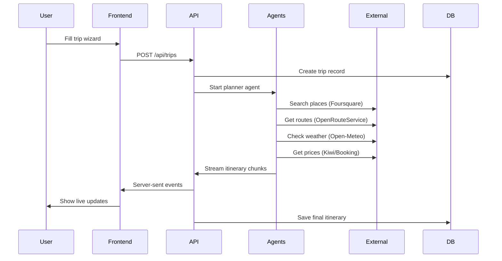
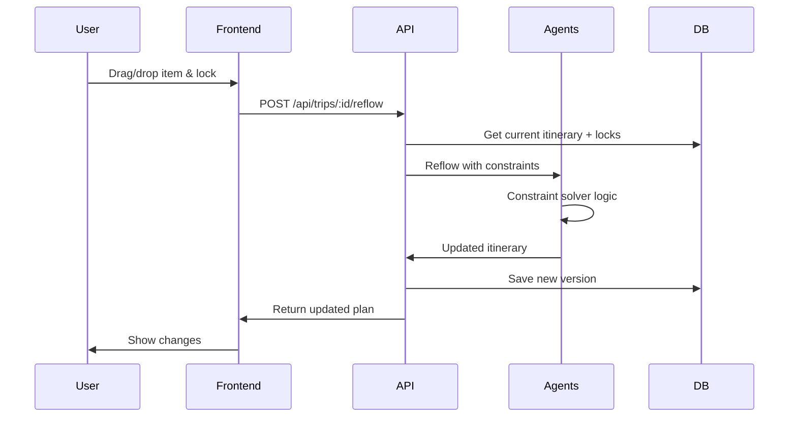

# Architecture Documentation

## Overview
Tripthesia is built as a modern, AI-first travel planning platform with a layered architecture designed for scalability and performance.

## System Architecture

### High-Level Architecture
```
┌─────────────────┐    ┌─────────────────┐    ┌─────────────────┐
│   Frontend      │    │   Backend       │    │   External      │
│   (Next.js)     │    │   (API Routes)  │    │   Services      │
├─────────────────┤    ├─────────────────┤    ├─────────────────┤
│ • React 18      │    │ • Route Handlers│    │ • Claude AI     │
│ • TailwindCSS   │◄──►│ • AI Agents     │◄──►│ • Foursquare    │
│ • Mapbox GL     │    │ • Drizzle ORM   │    │ • Kiwi Tequila  │
│ • TanStack Query│    │ • Redis Cache   │    │ • Stripe        │
│ • Zustand       │    │ • Webhooks      │    │ • Mapbox        │
└─────────────────┘    └─────────────────┘    └─────────────────┘
         │                       │                       │
         └───────────────────────┼───────────────────────┘
                                 │
                    ┌─────────────────┐
                    │   Database      │
                    │   (Neon PG)     │
                    ├─────────────────┤
                    │ • PostGIS       │
                    │ • Drizzle ORM   │
                    │ • Row Level Sec │
                    └─────────────────┘
```

### Data Flow Diagrams

#### New Trip Generation Flow


#### Edit with Lock-and-Reflow


### State Machines

#### Trip Lifecycle
```
draft → generating → planned → shared → traveling → completed
  ↑         ↓           ↓        ↓         ↓
  └─────────┼───────────┼────────┼─────────┘
            ↓           ↓        ↓
          failed    archived   expired
```

## Component Architecture

### Frontend Layers
1. **Pages Layer**: Next.js App Router pages
2. **Components Layer**: Reusable UI components
3. **Providers Layer**: Context providers (Auth, Query, Theme)
4. **Hooks Layer**: Custom React hooks
5. **Utils Layer**: Shared utilities

### Backend Layers
1. **API Layer**: Next.js route handlers
2. **Service Layer**: Business logic services
3. **Agent Layer**: AI orchestration
4. **Data Layer**: Database access
5. **Integration Layer**: External API clients

### Package Structure
- `apps/web`: Main Next.js application
- `packages/agents`: AI agents and tools
- `packages/ui`: Shared UI components
- `packages/config`: Shared configurations
- `infra/`: Database schema and migrations

## Security Architecture
- **Authentication**: Clerk with server-side sessions
- **Authorization**: Row Level Security in PostgreSQL
- **API Security**: Rate limiting, input validation
- **Data Protection**: Encrypted secrets, GDPR compliance

## Performance Considerations
- **Caching**: Multi-layer caching (Redis, SWR, CDN)
- **Streaming**: Real-time itinerary generation
- **Code Splitting**: Lazy loading of components
- **Database**: Optimized queries with proper indexing

## Deployment Architecture
- **Platform**: Vercel (Edge Runtime)
- **Database**: Neon (Serverless PostgreSQL)
- **Cache**: Upstash Redis
- **CDN**: Vercel Edge Network
- **Monitoring**: Sentry + PostHog