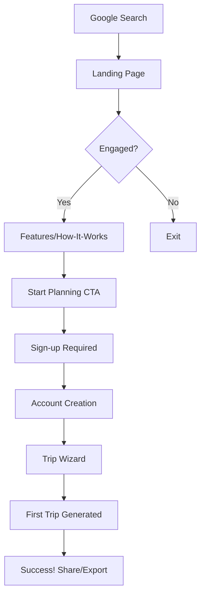
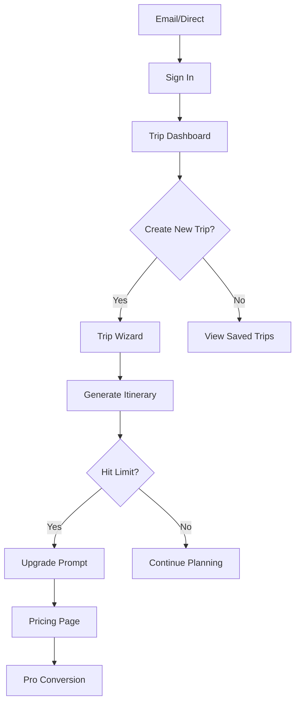

# Tripthesia Information Architecture v1.1

**Version**: 1.1.0  
**Last Updated**: August 19, 2025  
**Status**: Architecture Redesign  
**Objective**: Transform navigation and user flows for optimal conversion

---

## 🎯 IA STRATEGY OVERVIEW

### **Core Principles**

**1. Conversion-First Hierarchy**
- Primary CTA ("Start Planning") always visible and prominent
- Clear funnel from awareness → trial → conversion → retention
- Reduce cognitive load with intuitive navigation patterns

**2. User Journey Optimization**
- Progressive disclosure of complexity
- Clear entry points for different user types
- Seamless flow between marketing and application

**3. Content Strategy Alignment**  
- SEO-optimized page structure for travel queries
- Educational content that builds trust
- Social proof integrated throughout journey

---

## 🗺️ SITE ARCHITECTURE

### **Primary Site Structure**

```
tripthesia.com/
├── 🏠 Landing (/)
├── 📚 Marketing Pages
│   ├── /features
│   ├── /how-it-works  
│   ├── /pricing
│   ├── /city-guides (SEO hub)
│   │   ├── /city-guides/paris
│   │   ├── /city-guides/tokyo
│   │   └── /city-guides/[city]
│   └── /about
├── 🚀 Application Pages  
│   ├── /new (Trip Wizard)
│   ├── /trip/[id] (Planner)
│   ├── /trips (Dashboard)
│   ├── /shared/[token] (Public trips)
│   └── /settings
├── 👤 Account Pages
│   ├── /sign-in
│   ├── /sign-up  
│   ├── /billing
│   └── /upgrade
├── 🏢 Company Pages
│   ├── /support
│   ├── /contact
│   ├── /privacy
│   ├── /terms
│   └── /api-docs (future)
├── ⚡ Utility Pages
│   ├── /health
│   ├── /404
│   └── /500
└── 📡 API Routes
    ├── /api/trips
    ├── /api/search
    ├── /api/pricing
    └── /api/webhooks
```

---

## 🧭 NAVIGATION SYSTEM

### **Primary Navigation**

**Header Navigation (Always Visible)**
```
[Logo] — [Product ▼] — [Pricing] — [Resources ▼] — [Sign In] — [Start Planning ✨]
```

**Navigation Breakdown:**

1. **Tripthesia Logo** 
   - Links to homepage
   - Always visible, consistent placement
   - Includes subtle travel icon element

2. **Product** (Dropdown)
   - How It Works
   - Features  
   - Live Demo
   - City Guides
   - Integration Partners

3. **Pricing**
   - Direct link to pricing page
   - Clear, single click to understand costs

4. **Resources** (Dropdown)  
   - Help Center
   - Travel Guides
   - Blog (future)
   - API Documentation (future)
   - Contact Support

5. **Sign In**
   - For existing users
   - Links to Clerk sign-in

6. **Start Planning** (Primary CTA)
   - Prominent emerald button
   - Links to /new for signed-in users
   - Links to sign-up for anonymous users

### **Mobile Navigation**

**Mobile Header:**
```
[☰ Menu] — [Logo] — [Start Planning]
```

**Mobile Menu (Slide-out):**
```
┌─ Start Planning (Primary CTA)
├─ How It Works
├─ Features  
├─ Pricing
├─ City Guides
├─ Sign In
├─ Support
└─ About
```

### **Footer Navigation**

**Organized into 4 columns:**

**Column 1: Product**
- How It Works
- Features
- Pricing
- Live Demo
- City Guides

**Column 2: Company**  
- About Tripthesia
- Careers (future)
- Press Kit (future)
- Contact Us
- Partner With Us

**Column 3: Resources**
- Help Center
- Travel Guides  
- API Docs (future)
- Status Page
- Changelog (future)

**Column 4: Legal**
- Privacy Policy
- Terms of Service
- Cookie Policy
- GDPR Info
- Security

---

## 👤 USER JOURNEY MAPPING

### **Primary User Flows**

#### **Flow 1: Discovery → Trial (Anonymous User)**


**Key Optimizations:**
- Clear value prop immediately visible
- Interactive demo on landing page
- Social proof throughout flow
- Minimal friction to trial

#### **Flow 2: Return User → Pro Conversion**


**Key Optimizations:**
- Contextual upgrade prompts
- Clear limit communication  
- Value demonstration before paywall
- Seamless billing flow

#### **Flow 3: SEO → Conversion (City Guide Entry)**
```mermaid
graph TD
    A[Google: "3 days Paris itinerary"] --> B[/city-guides/paris]
    B --> C[Curated Itinerary Preview]
    C --> D["Customize This Trip" CTA]
    D --> E{Signed In?}
    E -->|No| F[Sign-up Wall]
    E -->|Yes| G[Pre-filled Wizard]
    F --> H[Account Creation]
    H --> G
    G --> I[Personalized Itinerary]
```

**Key Optimizations:**
- SEO-optimized city pages
- Template-based trip starters
- Pre-filled trip data to reduce friction
- Clear customization options

---

## 📄 PAGE SPECIFICATIONS

### **Landing Page (/) - Conversion Hub**

**Above the Fold:**
- Hero with value proposition
- Interactive world map or demo preview
- Primary CTA: "Start Planning Free"
- Social proof (user count, testimonials)

**Midfold:**
- "How It Works" - 3 simple steps  
- Feature highlights with icons
- Partner logos and trust signals
- Secondary CTA: "See How It Works"

**Below the Fold:**
- Customer testimonials with photos
- Pricing preview (not full table)
- FAQ section addressing common concerns
- Final CTA: "Start Your Perfect Trip"

### **Features Page (/features) - Education Hub**

**Structure:**
- Hero: "Everything you need to plan the perfect trip"
- Feature grid with interactive demos
- Comparison table vs. competitors
- Integration showcase
- Developer/API preview (future)
- CTA: "Try These Features Free"

### **How It Works (/how-it-works) - Process Education**

**Structure:**
- Hero: "From idea to itinerary in 60 seconds"
- Step-by-step visual workflow
- Interactive demo of each step
- Video walkthrough (future)
- Success stories
- CTA: "Start Planning Now"

### **Pricing (/pricing) - Conversion Page**

**Structure:**
- Hero: Clear value proposition
- 3-tier comparison table
- Toggle: Monthly/Yearly (with discount)
- FAQ section
- Calculator: "How much could you save?"
- Trust signals: "No hidden fees, cancel anytime"
- CTA: "Start Free Trial"

### **City Guides (/city-guides) - SEO Hub**

**Index Page:**
- Search/filter by region, vibe, duration
- Featured city cards with sample itineraries
- "Popular This Month" section
- "Create Custom Trip" CTA

**Individual City Pages (/city-guides/[city]):**
- Hero with city imagery
- Sample 3-day, 5-day, 7-day itineraries
- Best time to visit information
- Budget estimates
- "Customize This Itinerary" CTA
- User-generated trip examples

---

## 🔄 USER FLOW OPTIMIZATIONS

### **Onboarding Flow Improvements**

**Current Issues:**
- Complex 8-step wizard overwhelming users
- No preview of final output
- Basic form inputs without smart features

**Proposed Solutions:**
1. **Progressive Disclosure:** Start with just destination + dates
2. **Smart Defaults:** Pre-fill based on user profile/location
3. **Preview Mode:** Show sample itinerary while building
4. **Skip Options:** Allow users to generate with minimal info
5. **Save Progress:** Auto-save wizard progress

### **Conversion Flow Optimizations**

**Free to Pro Conversion Points:**
1. **Limit Reached:** After 2 free trips per month
2. **Premium Feature:** Advanced reflow/reroute options
3. **Export Desire:** PDF/calendar export requires Pro
4. **Collaboration:** Sharing with team requires Pro
5. **Priority Support:** Complex itinerary needs help

**Upgrade Prompts:**
- Contextual, not intrusive
- Clear value proposition
- "Upgrade to unlock" not "You can't do this"
- One-click upgrade flow

### **Retention Flow Design**

**Email Sequence:**
1. **Welcome:** "Your first trip is ready to plan"
2. **Day 3:** "5 ways to make your trip even better"  
3. **Week 1:** "Other travelers loved these destinations"
4. **Month 1:** "Ready to plan your next adventure?"

**In-App Retention:**
- Trip reminders and weather updates
- Destination suggestions based on previous trips
- Friend referral rewards
- Travel milestone celebrations

---

## 🔍 SEO & CONTENT STRATEGY

### **SEO Page Hierarchy**

**Primary Keywords by Page:**
- **Landing:** "AI travel planner", "trip planning app", "itinerary generator"
- **Features:** "travel planning features", "AI trip organizer", "smart itinerary"
- **How It Works:** "how to plan a trip", "trip planning steps", "itinerary planning"
- **City Guides:** "[City] itinerary", "[City] travel guide", "[X] days in [City]"

### **Content Hub Strategy**

**City Guides as SEO Foundation:**
- Target "X days in [City]" keywords
- High-quality, curated content
- User-generated trip examples
- Regular updates with seasonal info
- Local expertise and insider tips

**Future Content Expansion:**
- Travel tips blog
- Destination deep-dives
- Travel hacks and guides
- Partner content integration

### **Internal Linking Strategy**

**Hub and Spoke Model:**
- Landing page as primary hub
- City guides as secondary hubs
- Cross-linking between related destinations
- Feature pages link to relevant city examples
- Pricing page linked from all key conversion points

---

## 📱 RESPONSIVE NAVIGATION

### **Desktop Navigation (1024px+)**
- Full horizontal navigation with dropdowns
- Sticky header with background blur on scroll
- Breadcrumbs on deep pages
- Sidebar navigation in app pages

### **Tablet Navigation (768-1023px)**  
- Condensed horizontal navigation
- Some items move to hamburger menu
- Sticky header maintained
- Touch-friendly interaction zones

### **Mobile Navigation (<768px)**
- Hamburger menu with slide-out drawer
- Prominent logo and primary CTA remain
- Bottom navigation in app (future)
- Gesture-friendly navigation

---

## ♿ ACCESSIBILITY CONSIDERATIONS

### **Navigation Accessibility**

**Keyboard Navigation:**
- Tab order follows logical flow
- Skip links for main content
- Focus indicators clearly visible
- Dropdown menus keyboard accessible

**Screen Reader Support:**
- ARIA landmarks for navigation regions
- Proper heading hierarchy (h1→h2→h3)
- Link text descriptive and unique
- Navigation changes announced

**Mobile Accessibility:**
- Touch targets minimum 44px
- Sufficient color contrast
- Text remains readable when zoomed to 200%
- No horizontal scrolling required

---

## 📊 SUCCESS METRICS

### **Navigation Performance KPIs**

**Engagement Metrics:**
- **Navigation Click-Through Rate:** Target 15%+ for main nav items
- **Menu Depth:** Average 2.5 clicks to reach destination
- **Search Usage:** <10% of users need search (good nav = less search)

**Conversion Metrics:**
- **Landing → Sign-up:** Target 8-12%
- **Features → Trial:** Target 25-30%
- **Pricing → Conversion:** Target 15-20%

**User Experience Metrics:**
- **Task Completion Rate:** 90%+ for primary flows
- **Time to First Trip:** <90 seconds from sign-up
- **Navigation Satisfaction:** 4.5+/5 in user surveys

### **A/B Testing Opportunities**

1. **CTA Button Text:** "Start Planning" vs "Plan My Trip" vs "Create Itinerary"
2. **Navigation Order:** Product-first vs Pricing-first
3. **Dropdown vs Direct Links:** Features as dropdown vs direct page
4. **Mobile Menu Style:** Slide-out vs full-screen overlay

---

## 🚀 IMPLEMENTATION PHASES

### **Phase 3A: Core Navigation (Week 1)**
- [ ] Header navigation with new structure
- [ ] Footer with organized link architecture  
- [ ] Mobile hamburger menu
- [ ] Breadcrumb system for deep pages

### **Phase 3B: User Flows (Week 2)**
- [ ] Optimized onboarding wizard flow
- [ ] Conversion funnel improvements
- [ ] Contextual upgrade prompts
- [ ] Email sequence triggers

### **Phase 3C: SEO Structure (Week 3)**  
- [ ] URL structure optimization
- [ ] Internal linking implementation
- [ ] City guides page templates
- [ ] Sitemap and robots.txt

### **Phase 3D: Analytics & Testing (Week 4)**
- [ ] Navigation event tracking
- [ ] Conversion funnel analytics
- [ ] A/B testing framework
- [ ] User behavior heatmaps

---

## 📋 MIGRATION CHECKLIST

### **URL Changes Required**
- [ ] Set up redirects for any changed URLs
- [ ] Update internal links throughout site
- [ ] Submit new sitemap to search engines
- [ ] Update any external link references

### **Content Updates Required**  
- [ ] Navigation menu labels and descriptions
- [ ] Call-to-action button text
- [ ] Page meta titles and descriptions
- [ ] Footer link organization

### **Technical Implementation**
- [ ] Next.js routing for new structure
- [ ] Component-based navigation system
- [ ] Responsive navigation components
- [ ] Analytics tracking for new structure

---

## 🔄 ONGOING OPTIMIZATION

### **Quarterly Reviews**
- Navigation analytics and user feedback
- Conversion funnel performance analysis
- SEO performance and keyword rankings
- User testing of key flows

### **Monthly Updates**
- City guide content additions
- Navigation menu optimizations based on data
- A/B testing new navigation elements
- User feedback implementation

---

**Information Architecture Owner:** Claude Code Assistant  
**Implementation Timeline:** August 19-26, 2025  
**Success Review:** September 19, 2025  
**Next Evolution:** Q4 2025 - Advanced personalization and AI-driven navigation